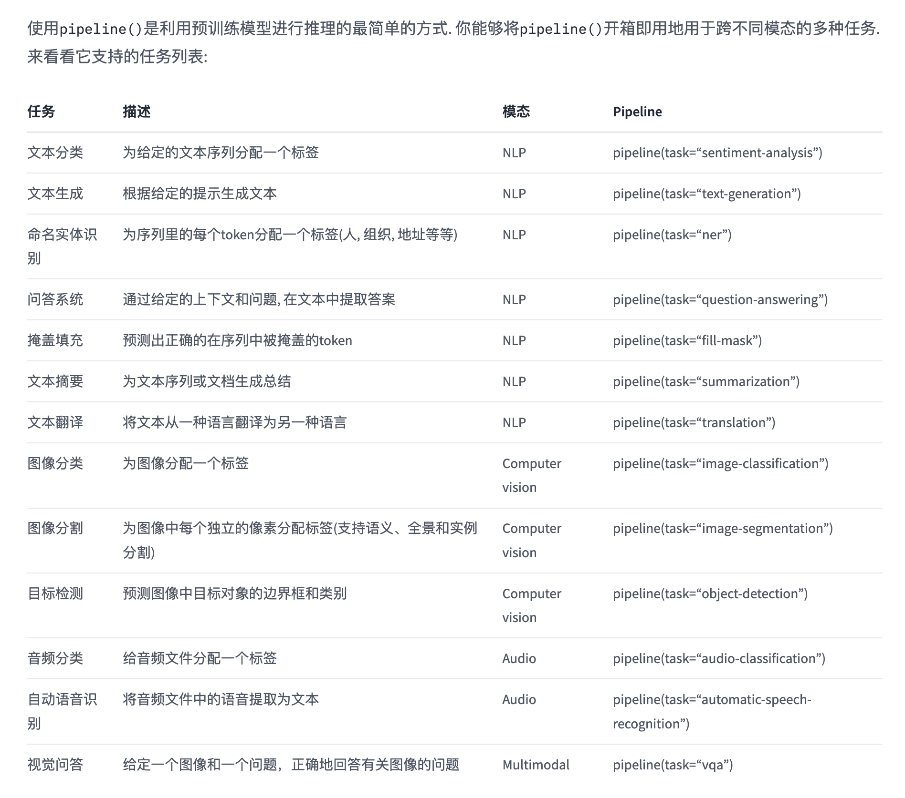

# Hugging Face
Hugging Face 是一个 NLP 工具集和平台，其中包括预训练语言模型、文本分类、命名实体识别、文本生成等任务的实现，同时也提供了一些有用的工具和库，如 transformers 库、datasets 库等。

https://huggingface.co/
https://github.com/huggingface/transformers
https://github.com/huggingface/transformers/blob/main/README_zh-hans.md
https://huggingface.co/docs/transformers/v4.28.1/zh/index


# pipelines
Transformers 库将目前的 NLP 任务归纳为几下几类：
- 文本分类：例如情感分析、句子对关系判断等；
- 对文本中的词语进行分类：例如词性标注 (POS)、命名实体识别 (NER) 等；
- 文本生成：例如填充预设的模板 (prompt)、预测文本中被遮掩掉 (masked) 的词语；
- 从文本中抽取答案：例如根据给定的问题从一段文本中抽取出对应的答案；
- 根据输入文本生成新的句子：例如文本翻译、自动摘要等。

Transformers 库最基础的对象就是 pipeline() 函数，它封装了预训练模型和对应的前处理和后处理环节。我们只需输入文本，就能得到预期的答案。

目前常用的 pipelines 有：
使用pipeline()是利用预训练模型进行推理的最简单的方式. 你能够将pipeline()开箱即用地用于跨不同模态的多种任务.
- 文本分类	为给定的文本序列分配一个标签	NLP	pipeline(task=“sentiment-analysis”)
- 文本生成	根据给定的提示生成文本	NLP	pipeline(task=“text-generation”)
- 命名实体识别	为序列里的每个token分配一个标签(人, 组织, 地址等等)	NLP	pipeline(task=“ner”)
- 问答系统	通过给定的上下文和问题, 在文本中提取答案	NLP	pipeline(task=“question-answering”)
- 掩盖填充	预测出正确的在序列中被掩盖的token	NLP	pipeline(task=“fill-mask”)
- 文本摘要	为文本序列或文档生成总结	NLP	pipeline(task=“summarization”)
- 文本翻译	将文本从一种语言翻译为另一种语言	NLP	pipeline(task=“translation”)
- 图像分类	为图像分配一个标签	Computer vision	pipeline(task=“image-classification”)
- 图像分割	为图像中每个独立的像素分配标签(支持语义、全景和实例分割)	Computer vision	pipeline(task=“image-segmentation”)
- 目标检测	预测图像中目标对象的边界框和类别	Computer vision	pipeline(task=“object-detection”)
- 音频分类	给音频文件分配一个标签	Audio	pipeline(task=“audio-classification”)
- 自动语音识别	将音频文件中的语音提取为文本	Audio	pipeline(task=“automatic-speech-recognition”)
- 视觉问答	给定一个图像和一个问题，正确地回答有关图像的问题	Multimodal	pipeline(task=“vqa”)



## pipeline 处理流程
这些简单易用的 pipeline 模型实际上封装了许多操作，下面我们就来了解一下它们背后究竟做了啥
实际上它的背后经过了三个步骤：

1. 预处理 (preprocessing)，将原始文本转换为模型可以接受的输入格式；
2. 将处理好的输入送入模型；
3. 对模型的输出进行后处理 (postprocessing)，将其转换为人类方便阅读的格式。

情感分析 pipeline 的默认 checkpoint 是 distilbert-base-uncased-finetuned-sst-2-english
## 1.使用分词器进行预处理
因为神经网络模型无法直接处理文本，因此首先需要通过预处理环节将文本转换为模型可以理解的数字。具体地，我们会使用每个模型对应的分词器 (tokenizer) 来进行：

1. 将输入切分为词语、子词或者符号（例如标点符号），统称为 tokens；
2. 根据模型的词表将每个 token 映射到对应的 token 编号（就是一个数字）；
3. 根据模型的需要，添加一些额外的输入。

我们对输入文本的预处理需要与模型自身预训练时的操作完全一致，只有这样模型才可以正常地工作。
注意，每个模型都有特定的预处理操作，如果对要使用的模型不熟悉，可以通过 Model Hub 查询。
这里我们使用 AutoTokenizer 类和它的 from_pretrained() 函数，它可以自动根据模型 checkpoint 名称来获取对应的分词器。
```
{
    'input_ids': tensor([
        [  101,  1045,  1005,  2310,  2042,  3403,  2005,  1037, 17662, 12172, 2607,  2026,  2878,  2166,  1012,   102],
        [  101,  1045,  5223,  2023,  2061,  2172,   999,   102,     0,     0,
             0,     0,     0,     0,     0,     0]
    ]), 
    'attention_mask': tensor([
        [1, 1, 1, 1, 1, 1, 1, 1, 1, 1, 1, 1, 1, 1, 1, 1],
        [1, 1, 1, 1, 1, 1, 1, 1, 0, 0, 0, 0, 0, 0, 0, 0]
    ])
}
```
可以看到，输出中包含两个键 `input_ids` 和 `attention_mask`，其中 input_ids 对应分词之后的 tokens 映射到的数字编号列表，而 attention_mask 则是用来标记哪些 tokens 是被填充的（这里“1”表示是原文，“0”表示是填充字符）。
## 2.将预处理好的输入送入模型
预训练模型的下载方式和分词器 (tokenizer) 类似，Transformers 包提供了一个 AutoModel 类和对应的 from_pretrained() 函数。
预训练模型的本体只包含基础的 Transformer 模块，对于给定的输入，它会输出一些神经元的值，称为 hidden states 或者特征 (features)。对于 NLP 模型来说，可以理解为是文本的高维语义表示。这些 hidden states 通常会被输入到其他的模型部分（称为 head），以完成特定的任务，例如送入到分类头中完成文本分类任务。

```
Transformers 库封装了很多不同的结构，常见的有：

*Model （返回 hidden states）
*ForCausalLM （用于条件语言模型）
*ForMaskedLM （用于遮盖语言模型）
*ForMultipleChoice （用于多选任务）
*ForQuestionAnswering （用于自动问答任务）
*ForSequenceClassification （用于文本分类任务）
*ForTokenClassification （用于 token 分类任务，例如 NER）
```
Transformer 模块的输出是一个维度为 (Batch size, Sequence length, Hidden size) 的三维张量，其中 Batch size 表示每次输入的样本（文本序列）数量，即每次输入多少个句子，上例中为 2；Sequence length 表示文本序列的长度，即每个句子被分为多少个 token，上例中为 16；Hidden size 表示每一个 token 经过模型编码后的输出向量（语义表示）的维度。
预训练模型编码后的输出向量的维度通常都很大，例如 Bert 模型 base 版本的输出为 768 维，一些大模型的输出维度为 3072 甚至更高。
## 3.对模型输出进行后处理


# Model & Tokenizer
模型和分词器
AutoTokenizer 和 AutoModelForSequenceClassification 类会自动从 Hugging Face 的模型库中下载所需的 model 和 tokenizer。


## 使用分词器进行预处理
对输入数据进行预处理，并将其标记化为模型所需的格式


我们对输入文本的预处理需要与模型自身预训练时的操作完全一致，只有这样模型才可以正常地工作。
注意，每个模型都有特定的预处理操作，如果对要使用的模型不熟悉，可以通过 [https://huggingface.co/models](https://huggingface.co/models) 查询。

这里我们使用 AutoTokenizer 类和它的 from_pretrained() 函数，它可以自动根据模型 checkpoint 名称来获取对应的分词器。

```angular2html
inputs = tokenizer(text, padding=True, truncation=True, return_tensors="pt")
```
这里的 text 是您要处理的文本数据。padding 和 truncation 参数用于处理不同长度的文本，return_tensors="pt" 则表示返回 PyTorch 张量格式的输入数据。